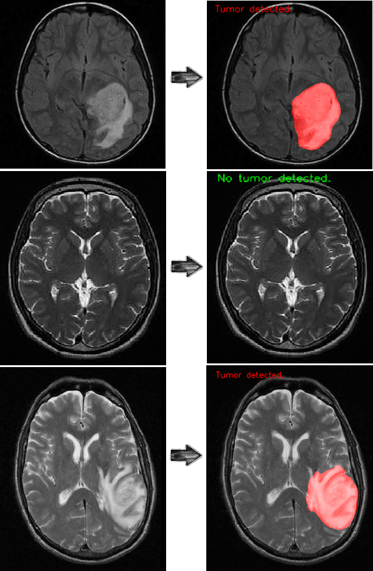

# Brain-tumor-detection
The architecture was inspired by [U-Net: Convolutional Networks for Biomedical Image Segmentation](http://lmb.informatik.uni-freiburg.de/people/ronneber/u-net/).
-------
## overview
# Data

The original dataset is from [Kaggle: Br35H::Brain Tumor Detection 2020](https://www.kaggle.com/ahmedhamada0/brain-tumor-detection), and I've downloaded it and making PNG annotations from JSON annotation, and done the pre-processing. 

Since the original dataset has 500 images for training and this number is small, I collected more data from different sources and generated more data using Flimimg.py. You can find it in /ImageSegmentation/MakeMoreData/ and use this dataset to train your custom model.

You can by using [this site: Makesense](https://www.makesense.ai/) annotate your data and use the JsonAnnotation_to_JpgAnnotation.py to make the PNG annotations. You can find it in /ImageSegmentation/AnnotationMaker/ .

-------
## Model
# Unet Architecture

This deep neural network is implemented with Keras functional API.

### Training
# U-net
The model is trained for 10 epochs.
After 10 epochs, calculated accuracy is about 0.98.
Loss function for the training is basically just a binary crossentropy
You can download my trained model from [U-net](https://drive.google.com/drive/folders/1qt7l3HOGIwOguWsMKc5fuwG2NGiGOucf?usp=sharing)

# CNN
The model is trained for 15 epochs.
After 15 epochs, calculated accuracy is about 0.996.
Loss function for the training is basically just a binary crossentropy
You can download my trained model from [CNN](https://drive.google.com/drive/folders/1fXFzMwNG6HrbNp6-GASAgeybeSB3JWCd?usp=sharing)

----
## How to use
### Run detectBT.py
### Or follow notebook and codes
-----------
### Results
Use the trained model to do segmentation on test images. The result is satisfactory.

